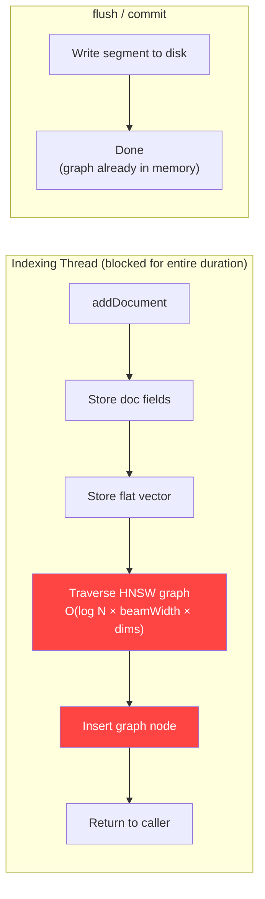
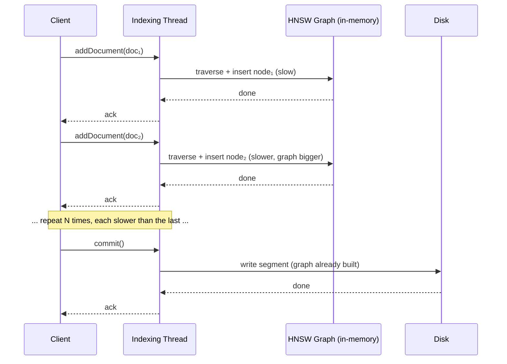
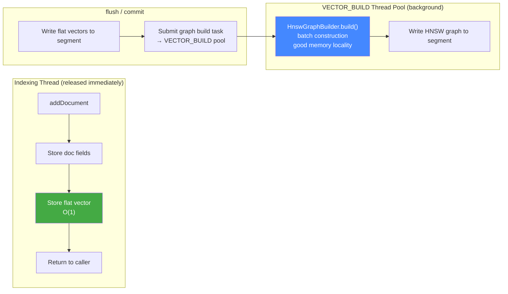
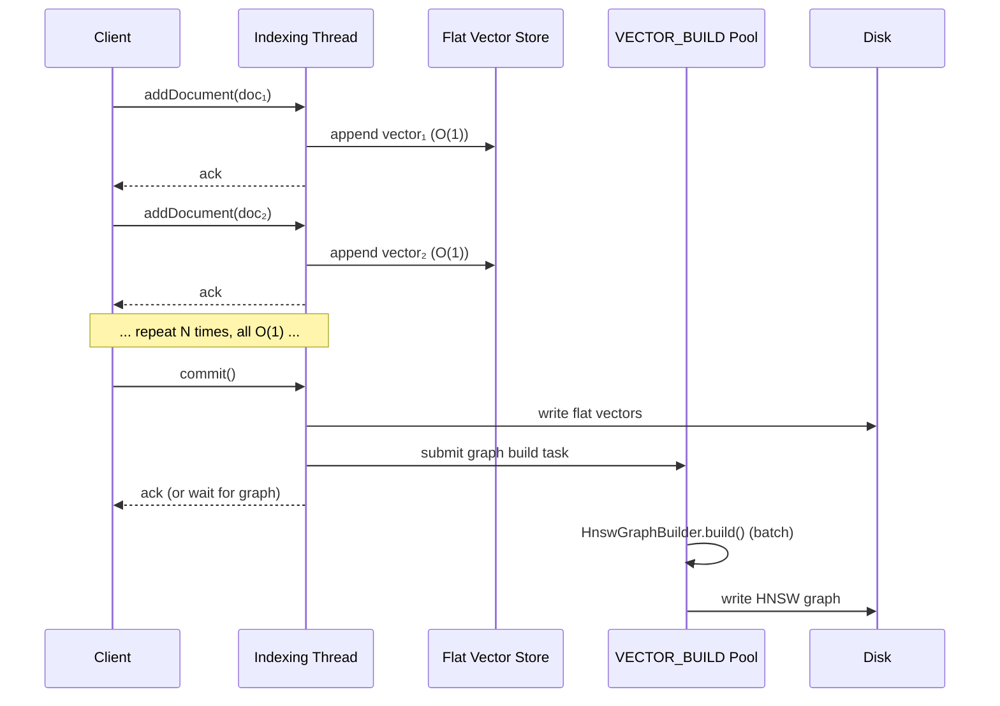
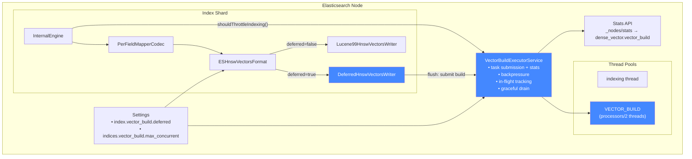

# Async Vector Index Building

## Problem

Elasticsearch's HNSW vector indexing builds the graph **incrementally during `addDocument()`**. Each document insertion traverses the existing graph to find neighbors — O(log N * beamWidth) per document, with each neighbor comparison costing O(dims) for distance computation. This means:

1. **The indexing thread is blocked** doing expensive graph traversal for every document, starving other work (search serving, merges, refresh).
2. **Cost grows super-linearly** with corpus size — inserting the 100,000th vector is far more expensive than the 1st.
3. **High-dimensional vectors amplify the problem** — 768-dim embeddings (common for modern models like sentence-transformers) make every neighbor comparison ~6x more expensive than 128-dim.

For workloads with large vector fields, HNSW graph construction dominates indexing latency and becomes the bottleneck for both throughput and search tail latency.

## Approach

Decouple graph construction from the per-document indexing path by deferring it to flush time on a dedicated thread pool.

### Architecture

#### Before: Inline Graph Building

Every `addDocument()` call performs the full HNSW graph insertion on the indexing thread. The graph traversal cost grows with corpus size and vector dimensionality.





#### After: Deferred Graph Building

`addDocument()` only stores the flat vector — O(1) per document. Graph construction is batched at flush time and offloaded to the dedicated VECTOR_BUILD thread pool.





#### Component Overview



### Implementation (7 commits)

| Phase | Commit | What |
|-------|--------|------|
| 0 | `a36233e` | **VECTOR_BUILD thread pool + VectorBuildExecutorService** — dedicated fixed-size thread pool (`processors/2`, min 1) for graph construction. `VectorBuildExecutorService` wraps it with task submission, stats tracking (pending/running/completed/build time/queue time), in-flight future tracking, and graceful drain on close. |
| 1 | `c3ac40b` | **DeferredHnswVectorsWriter** — `KnnVectorsWriter` that stores vectors flat during `addValue()` (delegating to `Lucene99FlatVectorsWriter`), then builds the HNSW graph from scratch at `flush()` via `HnswGraphBuilder.build()` on the VECTOR_BUILD pool. Handles both float and byte vectors, supports all similarity functions, and correctly delegates merges to Lucene's standard merge path. |
| 2 | `83dc1ed` | **ESHnswVectorsFormat + codec wiring** — `KnnVectorsFormat` wrapper that returns `DeferredHnswVectorsWriter` when a `VectorBuildExecutorService` is provided, else falls back to standard `Lucene99HnswVectorsWriter`. Wired into the ES codec factory via `PerFieldMapperCodec`. |
| 3 | `afeecd5` | **Backpressure in InternalEngine** — `shouldThrottleIndexing()` returns true when pending graph builds exceed `maxConcurrentBuilds`, triggering the existing write-throttle mechanism to slow down indexing and prevent unbounded memory growth. |
| 4 | `d485d81` | **Feature gate + tests** — `index.vector_build.deferred` (boolean, default false, IndexScope, Dynamic) controls per-index opt-in. Unit tests for `VectorBuildExecutorService`, format-level tests via `BaseKnnVectorsFormatTestCase`, integration test `DeferredVectorBuildIT` that indexes vectors, verifies kNN recall, and validates stats. |
| 5 | `33c7be6` | **Production readiness** — Stats API (vector build metrics exposed via `_nodes/stats` under `dense_vector.vector_build`), cluster settings wiring for `indices.vector_build.max_concurrent` (dynamic, node-scope), close safety (drain in-flight futures with 60s timeout on `VectorBuildExecutorService.close()`). |
| 6 | `fef7146` | **Benchmark + SPI fix** — JMH benchmark comparing inline vs deferred, plus missing SPI registration for `ESHnswVectorsFormat` (no-arg constructor + META-INF service entry). |

### Key Settings

| Setting | Scope | Default | Description |
|---------|-------|---------|-------------|
| `index.vector_build.deferred` | Index, Dynamic | `false` | Enable deferred graph building for this index |
| `indices.vector_build.max_concurrent` | Node, Dynamic | `processors/2` | Max concurrent graph builds across the node |

### Stats API

```
GET _nodes/stats/indices/dense_vector
```
```json
{
  "dense_vector": {
    "value_count": 12345,
    "vector_build": {
      "pending_tasks": 2,
      "running_tasks": 1,
      "completed_tasks": 100,
      "total_build_time_millis": 5432,
      "total_queue_time_millis": 123
    }
  }
}
```

## Benchmark Results

**Environment:** JMH SingleShotTime, 3 iterations, Lucene 9.12.2, Java 23, maxConn=16, beamWidth=100

### `addDocumentsOnly` — Indexing Thread Cost

This is the key metric: it measures only the `addDocument()` calls with no commit/flush, isolating the cost paid by the indexing thread.

#### Scaling by vector count (dims=128)

| numVectors | inline (ms) | deferred (ms) | speedup |
|------------|-------------|---------------|---------|
| 5,000      | 635         | 13            | **49x** |
| 10,000     | 1,043       | 5             | **209x** |
| 25,000     | 3,428       | 11            | **312x** |
| 50,000     | 8,315       | 29            | **287x** |
| 100,000    | 21,709      | 54            | **402x** |

Inline mode scales super-linearly — each insertion traverses a growing graph. Deferred mode stays near-constant (just appending flat vectors to a buffer).

#### Scaling by dimension (numVectors=50,000)

| dims | inline (ms) | deferred (ms) | speedup |
|------|-------------|---------------|---------|
| 64   | 5,976       | 43            | **139x** |
| 128  | 9,111       | 35            | **260x** |
| 256  | 11,338      | 35            | **324x** |
| 512  | 22,553      | 68            | **332x** |
| 768  | 32,821      | 101           | **325x** |

Inline cost grows linearly with dims (each neighbor comparison is O(dims)). Deferred stays flat — memcpy cost is trivial regardless of dimension.

### `indexAndFlush` — Full Cycle (add + commit/graph build + kNN search)

Total wall-clock time is comparable because the graph work is done either way — deferred mode just moves it from `addDocument()` to `commit()`.

#### Scaling by vector count (dims=128)

| numVectors | inline (ms) | deferred (ms) | delta |
|------------|-------------|---------------|-------|
| 5,000      | 848         | 497           | -41%  |
| 10,000     | 1,023       | 1,035         | ~0%   |
| 25,000     | 3,408       | 3,595         | +5%   |
| 50,000     | 9,114       | 6,650         | -27%  |
| 100,000    | 20,744      | 18,271        | -12%  |

#### Scaling by dimension (numVectors=50,000)

| dims | inline (ms) | deferred (ms) | delta |
|------|-------------|---------------|-------|
| 64   | 7,957       | 8,568         | +8%   |
| 128  | 9,498       | 10,088        | +6%   |
| 256  | 15,203      | 15,293        | ~0%   |
| 512  | 24,975      | 24,311        | -3%   |
| 768  | 40,677      | 40,680        | ~0%   |

Full-cycle times are within noise, confirming the graph work cost is equivalent — it's just scheduled differently.

## Key Takeaway

The value of deferred graph building is **not** faster total wall-clock for a single flush cycle. It's that the **indexing thread is freed 100–400x sooner**, which unlocks:

1. **Higher indexing throughput** — other documents and segments proceed without waiting for graph traversal. In a multi-shard, multi-index cluster this is the dominant effect.
2. **Lower search latency during indexing** — the indexing thread isn't blocked doing O(log N * dims) work per document, reducing contention with search-serving threads.
3. **Parallelized graph construction** — multiple segments can build their graphs concurrently on dedicated VECTOR_BUILD threads, rather than serializing everything on the per-shard indexing path.
4. **Backpressure without stalling** — when graph builds fall behind, the write-throttle mechanism gracefully slows indexing rather than blocking it entirely.

### When to enable

Enable `index.vector_build.deferred: true` for indices with:
- High-dimensional vector fields (256+ dims)
- High indexing throughput requirements
- Concurrent indexing and search workloads
- Multiple shards/indices with vector fields on the same node
