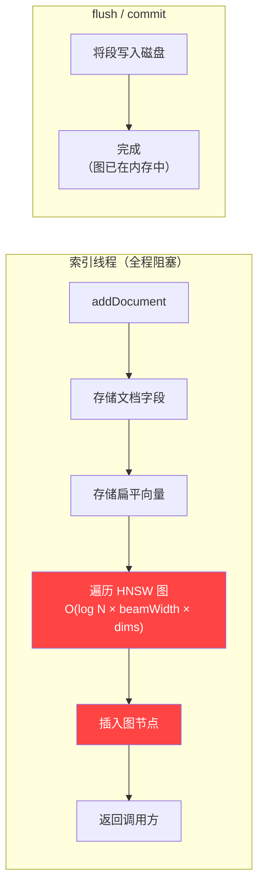
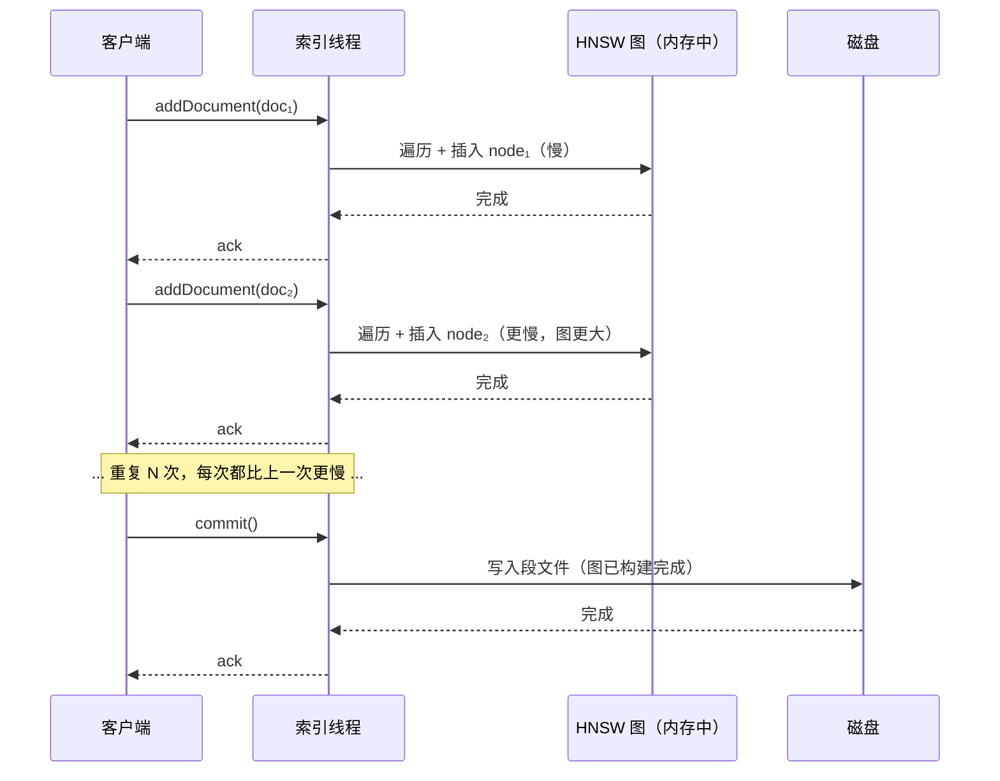
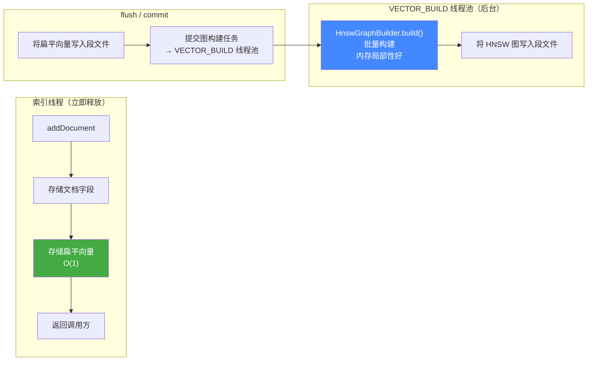
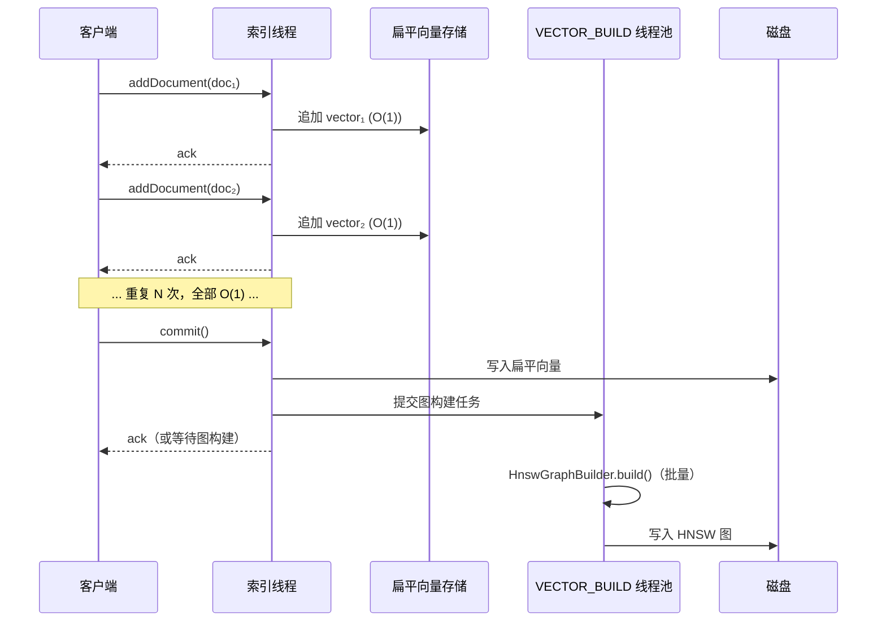
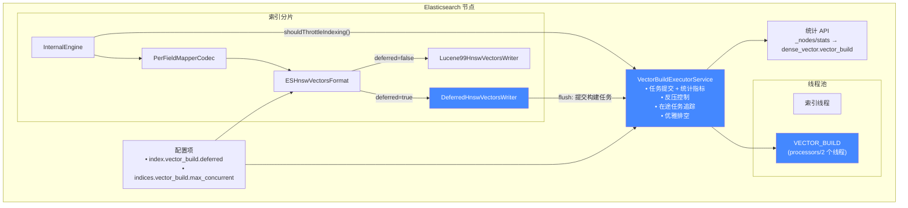

# 异步向量索引构建

## 问题背景

Elasticsearch 的 HNSW 向量索引在 **`addDocument()` 期间增量构建图**。每次文档插入都需要遍历已有图来寻找邻居节点——每个文档的开销为 O(log N * beamWidth)，且每次邻居比较的距离计算开销为 O(dims)。这带来以下问题：

1. **索引线程被阻塞**——每个文档都要执行高开销的图遍历，挤占搜索服务、段合并、refresh 等其他工作的资源。
2. **开销随数据量超线性增长**——插入第 100,000 个向量的代价远高于第 1 个。
3. **高维向量放大问题**——768 维嵌入向量（sentence-transformers 等现代模型的常见维度）使每次邻居比较的开销比 128 维高约 6 倍。

对于包含大规模向量字段的工作负载，HNSW 图构建主导了索引延迟，成为吞吐量和搜索尾部延迟的瓶颈。

## 方案设计

将图构建从逐文档的索引路径中解耦，延迟到 flush 时在专用线程池上执行。

### 架构对比

#### 改造前：内联图构建（Inline）

每次 `addDocument()` 调用都在索引线程上执行完整的 HNSW 图插入操作。图遍历开销随数据量和向量维度增长。





#### 改造后：延迟图构建（Deferred）

`addDocument()` 仅存储扁平向量——每个文档 O(1)。图构建在 flush 时批量执行，卸载到专用的 VECTOR_BUILD 线程池。





#### 组件总览



### 实现（7 个提交）

| 阶段 | 提交 | 内容 |
|------|------|------|
| 0 | `a36233e` | **VECTOR_BUILD 线程池 + VectorBuildExecutorService** —— 专用固定大小线程池（`processors/2`，最小为 1）用于图构建。`VectorBuildExecutorService` 封装了任务提交、统计指标追踪（pending/running/completed/构建耗时/排队耗时）、在途 Future 追踪，以及关闭时的优雅等待排空。 |
| 1 | `c3ac40b` | **DeferredHnswVectorsWriter** —— `KnnVectorsWriter` 实现，在 `addValue()` 期间仅以扁平格式存储向量（委托给 `Lucene99FlatVectorsWriter`），然后在 `flush()` 时通过 VECTOR_BUILD 线程池上的 `HnswGraphBuilder.build()` 从零构建 HNSW 图。支持 float 和 byte 两种向量类型、所有相似度函数，并正确地将段合并委托给 Lucene 的标准合并路径。 |
| 2 | `83dc1ed` | **ESHnswVectorsFormat + Codec 接入** —— `KnnVectorsFormat` 包装器，当提供 `VectorBuildExecutorService` 时返回 `DeferredHnswVectorsWriter`，否则回退到标准 `Lucene99HnswVectorsWriter`。通过 `PerFieldMapperCodec` 接入 ES 的 codec 工厂。 |
| 3 | `afeecd5` | **InternalEngine 中的反压机制** —— 当待处理的图构建任务超过 `maxConcurrentBuilds` 时，`shouldThrottleIndexing()` 返回 true，触发已有的写入限流机制减缓索引速度，防止内存无限增长。 |
| 4 | `d485d81` | **功能开关 + 测试** —— `index.vector_build.deferred`（布尔值，默认 false，IndexScope，支持动态修改）控制索引级别的启用。包含 `VectorBuildExecutorService` 的单元测试、基于 `BaseKnnVectorsFormatTestCase` 的格式级测试、以及 `DeferredVectorBuildIT` 集成测试（索引向量、验证 kNN 召回率、校验统计指标）。 |
| 5 | `33c7be6` | **生产就绪** —— Stats API（向量构建指标通过 `_nodes/stats` 的 `dense_vector.vector_build` 暴露）、`indices.vector_build.max_concurrent` 集群设置接入（动态、节点级别）、关闭安全性（`VectorBuildExecutorService.close()` 时以 60 秒超时等待在途 Future 排空）。 |
| 6 | `fef7146` | **性能基准测试 + SPI 修复** —— JMH 基准测试对比 inline 与 deferred 模式，以及补充 `ESHnswVectorsFormat` 缺失的 SPI 注册（无参构造函数 + META-INF 服务条目）。 |

### 关键配置

| 配置项 | 作用域 | 默认值 | 说明 |
|--------|--------|--------|------|
| `index.vector_build.deferred` | 索引级别，支持动态修改 | `false` | 为该索引启用延迟图构建 |
| `indices.vector_build.max_concurrent` | 节点级别，支持动态修改 | `processors/2` | 节点上最大并发图构建数 |

### 统计 API

```
GET _nodes/stats/indices/dense_vector
```
```json
{
  "dense_vector": {
    "value_count": 12345,
    "vector_build": {
      "pending_tasks": 2,
      "running_tasks": 1,
      "completed_tasks": 100,
      "total_build_time_millis": 5432,
      "total_queue_time_millis": 123
    }
  }
}
```

## 基准测试结果

**测试环境：** JMH SingleShotTime 模式，3 次迭代，Lucene 9.12.2，Java 23，maxConn=16，beamWidth=100

### `addDocumentsOnly` —— 索引线程开销

这是核心指标：仅测量 `addDocument()` 调用耗时，不包含 commit/flush，隔离了索引线程承担的实际开销。

#### 向量数量扩展（dims=128）

| 向量数量 | inline (ms) | deferred (ms) | 加速比 |
|----------|-------------|---------------|--------|
| 5,000    | 635         | 13            | **49x** |
| 10,000   | 1,043       | 5             | **209x** |
| 25,000   | 3,428       | 11            | **312x** |
| 50,000   | 8,315       | 29            | **287x** |
| 100,000  | 21,709      | 54            | **402x** |

Inline 模式开销超线性增长——每次插入都要遍历不断膨胀的图。Deferred 模式保持近乎恒定（仅追加扁平向量到缓冲区）。

#### 维度扩展（numVectors=50,000）

| 维度 | inline (ms) | deferred (ms) | 加速比 |
|------|-------------|---------------|--------|
| 64   | 5,976       | 43            | **139x** |
| 128  | 9,111       | 35            | **260x** |
| 256  | 11,338      | 35            | **324x** |
| 512  | 22,553      | 68            | **332x** |
| 768  | 32,821      | 101           | **325x** |

Inline 开销随维度线性增长（每次邻居比较为 O(dims)）。Deferred 保持平稳——无论维度多少，内存拷贝开销都微不足道。

### 索引吞吐量（由 `addDocumentsOnly` 数据推算）

同一组数据以 **docs/sec（文档/秒）** 表示——索引线程的有效吞吐量：

#### 向量数量扩展（dims=128）

| 向量数量 | inline (docs/sec) | deferred (docs/sec) | 加速比 |
|----------|-------------------|---------------------|--------|
| 5,000    | 7,874             | 384,615             | **49x** |
| 10,000   | 9,590             | 1,828,154           | **191x** |
| 25,000   | 7,290             | 2,189,826           | **300x** |
| 50,000   | 6,013             | 1,708,268           | **284x** |
| 100,000  | 4,606             | 1,859,671           | **404x** |

Inline 吞吐量随数据量增长持续下降（图遍历深度增加）。Deferred 吞吐量始终保持在 **100 万 docs/sec 以上**——索引线程的瓶颈仅在于内存带宽。

#### 维度扩展（numVectors=50,000）

| 维度 | inline (docs/sec) | deferred (docs/sec) | 加速比 |
|------|-------------------|---------------------|--------|
| 64   | 8,367             | 1,173,021           | **140x** |
| 128  | 5,489             | 1,447,178           | **264x** |
| 256  | 4,410             | 1,439,001           | **326x** |
| 512  | 2,217             | 737,681             | **333x** |
| 768  | 1,523             | 494,201             | **324x** |

在 768 维下，Inline 模式索引线程仅能处理 **1,523 docs/sec**。Deferred 仍可达 **49.4 万 docs/sec**——提升 324 倍。在真实集群中，这些被释放的索引线程容量可用于搜索服务、段合并、refresh 等其他工作。

### `indexAndFlush` —— 完整周期（写入 + commit/图构建 + kNN 搜索）

总耗时基本相当，因为图构建的工作量不变——deferred 模式只是把它从 `addDocument()` 搬到了 `commit()` 阶段。

#### 向量数量扩展（dims=128）

| 向量数量 | inline (ms) | deferred (ms) | 差异 |
|----------|-------------|---------------|------|
| 5,000    | 848         | 497           | -41% |
| 10,000   | 1,023       | 1,035         | ~0%  |
| 25,000   | 3,408       | 3,595         | +5%  |
| 50,000   | 9,114       | 6,650         | -27% |
| 100,000  | 20,744      | 18,271        | -12% |

#### 维度扩展（numVectors=50,000）

| 维度 | inline (ms) | deferred (ms) | 差异 |
|------|-------------|---------------|------|
| 64   | 7,957       | 8,568         | +8%  |
| 128  | 9,498       | 10,088        | +6%  |
| 256  | 15,203      | 15,293        | ~0%  |
| 512  | 24,975      | 24,311        | -3%  |
| 768  | 40,677      | 40,680        | ~0%  |

完整周期耗时在误差范围内，证实图构建的计算量是等价的——只是调度方式不同。

## 核心结论

延迟图构建的价值 **不在于** 单次 flush 周期的总耗时更快，而在于 **索引线程被释放的速度快了 100–400 倍**，由此带来：

1. **更高的索引吞吐量** —— 其他文档和段可以在不等待图遍历的情况下继续处理。在多分片、多索引的集群中，这是最主要的收益。
2. **索引期间更低的搜索延迟** —— 索引线程不再被 O(log N * dims) 的逐文档计算阻塞，减少了与搜索服务线程的资源争用。
3. **并行化图构建** —— 多个段可以在专用的 VECTOR_BUILD 线程上并发构建图，而非在每个分片的索引路径上串行执行。
4. **平滑的反压机制** —— 当图构建积压时，写入限流机制会优雅地降低索引速度，而不是完全阻塞。

### 适用场景

建议在以下场景的索引上启用 `index.vector_build.deferred: true`：
- 高维向量字段（256 维及以上）
- 高索引吞吐量需求
- 索引与搜索并发的工作负载
- 同一节点上存在多个包含向量字段的分片/索引
